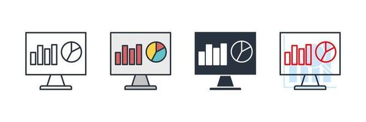

# Visualization Dashboard

This project provides an interactive dashboard designed to analyze various socio-economic and demographic factors influencing average monthly salaries across different cities. The dashboard leverages advanced data visualization techniques to enable users to explore trends, compare data points, and draw insights.

## Dashboard Website
https://visualization-dashboard-2024.streamlit.app/

## Key Features

- **City and Year Selection**: Allows users to select specific cities and years to explore demographic and economic data.
- **Dynamic Salary Prediction**: Users can adjust multiple factors via sliders to see real-time changes in predicted average monthly salaries based on a regression model.
- **Comparative Analysis**: Enables comparison of geographical and demographic data between cities using various chart types like pie charts and bar plots.
- **Interactive Map**: Displays a map with data points that reflect various statistics, allowing for geographical analysis at a glance.
- **Feature Importance Analysis**: The dashboard highlights which features most significantly impact the target variable, aiding users in understanding the model's predictions.

## Technologies Used

- **Python**: The entire backend, including data processing and visualization, is implemented in Python.
- **Streamlit**: Utilized for building an interactive and user-friendly web interface.
- **Pandas**: For data manipulation and analysis.
- **Plotly**: To create dynamic and interactive visualizations.
- **Folium**: Used for creating maps with various geographical data points.

## Project Structure

- **main.py**: The main script that initializes the Streamlit app and handles the dashboard's functionality.
- **.streamlit/**: Contains Streamlit configuration files for customizing the app's theme and settings.
- **cities.geojson**: A GeoJSON file for mapping geographical data points on Israel cities.
- **custom_color_bar.png**: An image used for visualizing a custom color bar in the dashboard.
- **israel_cities_map_2016.html, israel_cities_map_2018.html, israel_cities_map_2020.html**: HTML files containing pre-generated maps for different years.
- **min_max_values_adjusted.xlsx**: Excel file storing the minimum and maximum values of features for dynamic slider generation.
- **out.csv, out_modified.csv, out_with_coordinates.csv**: Data files containing processed and raw data used in the dashboard.
- **regression_coefficients.xlsx**: An Excel file storing regression coefficients used for salary predictions.
- **requirements.txt**: A text file listing all the dependencies required to run the project.
- **README.md**: The readme file providing an overview of the project and instructions for setup and usage.

## Contact
For any inquiries or issues, please open an issue on the GitHub repository or contact the maintainers directly:

Omri Arie – omriarie@gmail.com  
Project Link: https://github.com/omriarie/Visualization-Dashboard-
